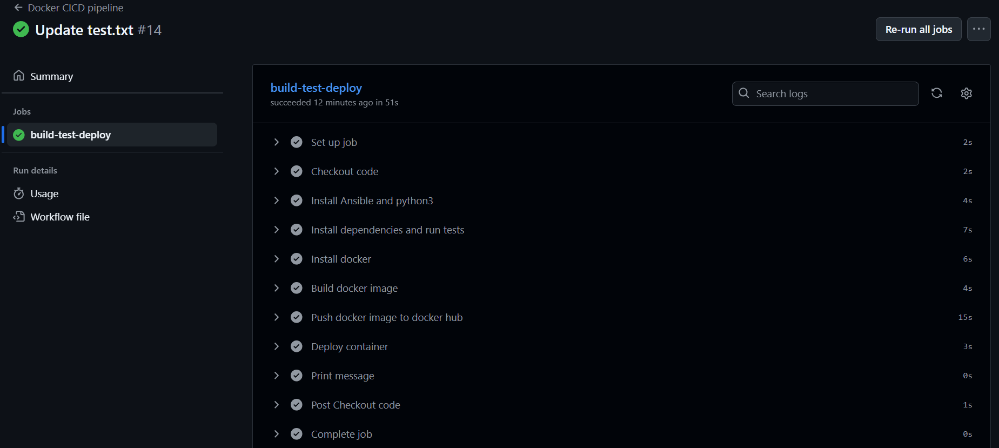
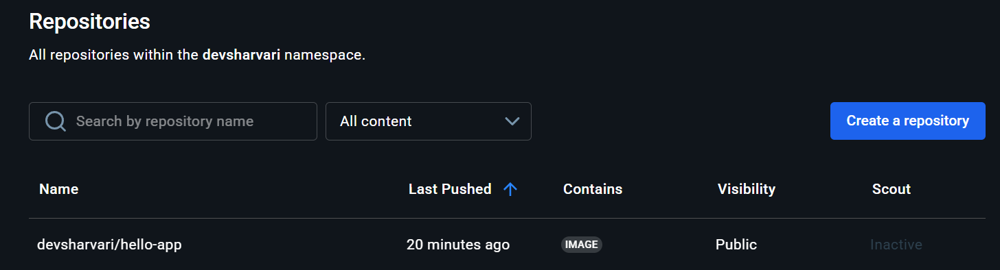
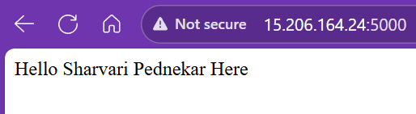

## ⚙️ CI/CD Pipeline with GitHub Actions

This project includes a **Docker-based CI/CD pipeline** implemented using **GitHub Actions** and **Ansible** on a self-hosted runner.  
The workflow automates testing, building, pushing, and deploying the application container.

### 🚀 Workflow Overview

| Step | Description |
|------|--------------|
| **1. Trigger** | Workflow runs automatically on push or pull request to the `main` branch. |
| **2. Checkout Code** | Fetches the latest source code from the repository. |
| **3. Install Dependencies** | Installs Python 3, pip, Ansible, and creates a virtual environment. |
| **4. Run Unit Tests** | Installs dependencies and executes tests using `pytest` to verify app functionality. |
| **5. Install Docker** | Uses Ansible playbook (`ansible/install_docker.yaml`) to set up Docker on the host. |
| **6. Build Docker Image** | Builds a Docker image named `hello-app:latest` from the Dockerfile. |
| **7. Push Image to Docker Hub** | Logs in using GitHub Secrets and uploads the image to your Docker Hub account. |
| **8. Deploy Container** | Pulls the latest image and runs it on port `5000` as a container. |
| **9. Success Message** | Prints a confirmation message after successful execution. |

### 📦Tools Used
- **GitHub Actions** – Automates the CI/CD pipeline
- **Python & Pytest** – Runs unit tests
- **Docker** – Builds and deploys the application container
- **Ansible** – Installs Docker and manages deployment

### Pre-requisite
**Set up self-hosted runner**
   - Install GitHub Actions runner on your server:
     ```bash
     mkdir actions-runner && cd actions-runner
     curl -o actions-runner-linux-x64.tar.gz -L https://github.com/actions/runner/releases/download/v2.305.0/actions-runner-linux-x64-2.305.0.tar.gz
     tar xzf ./actions-runner-linux-x64.tar.gz
     ./config.sh --url https://github.com/<username>/<repo> --token <runner-token>
     ./run.sh
     ```
   - This runner will execute workflow jobs on your server.
## Screenshots

### GitHub Actions Workflow


### Docker Image Build


### Running Application

